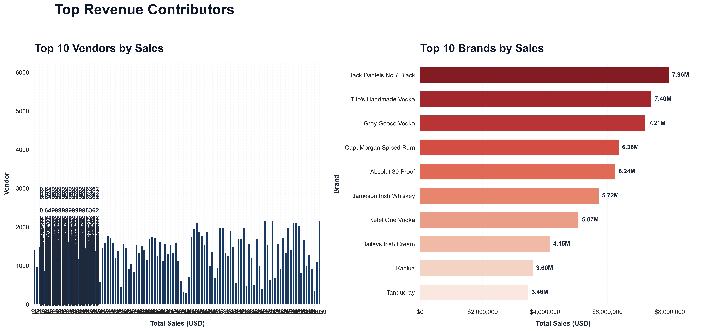
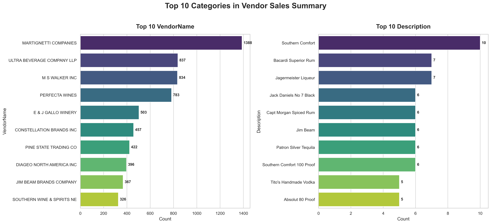
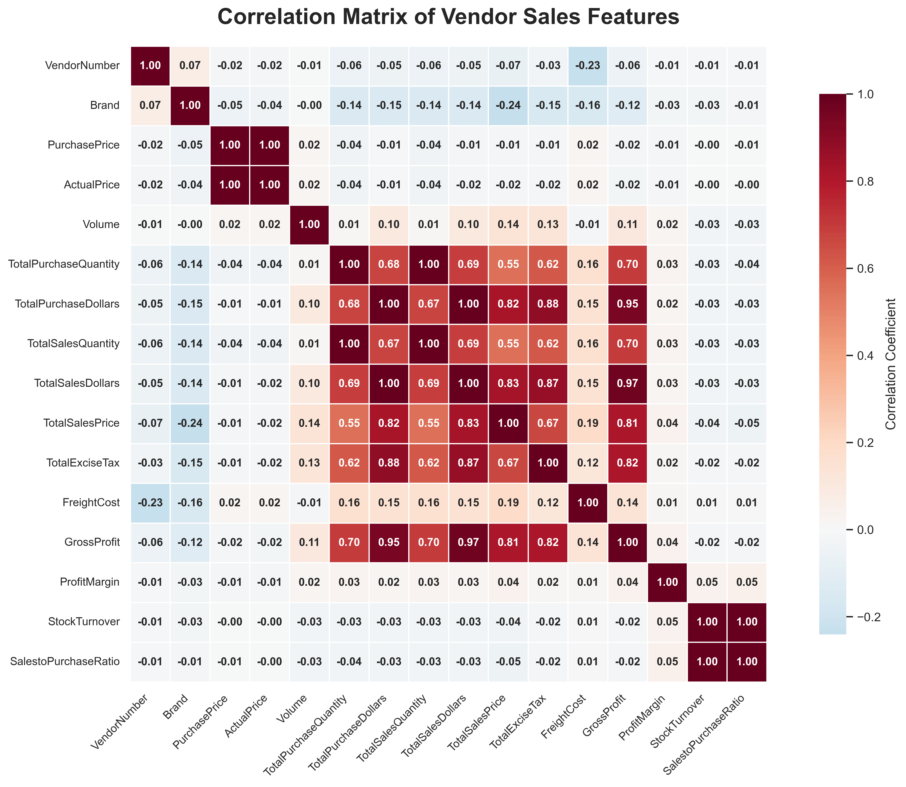
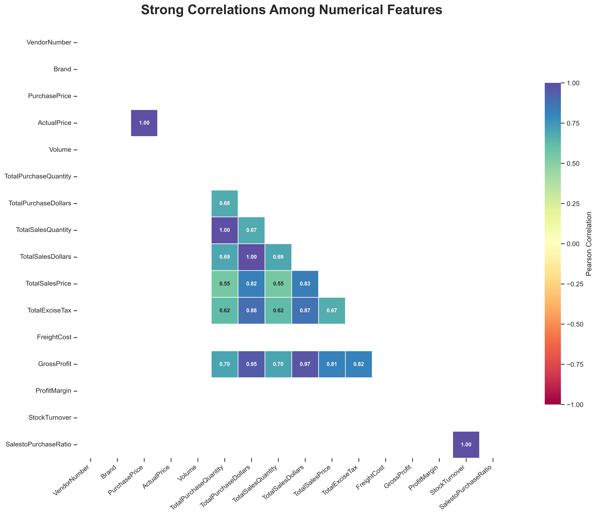

# 📊 Enterprise Vendor Sales Performance Analysis

A comprehensive end-to-end data analytics project that analyzes large-scale enterprise procurement and sales data using **SQL, Python, Statistical Analysis, and Interactive Visualizations**. This project demonstrates a production-style analytics workflow—from data ingestion and transformation to business intelligence dashboards and statistical validation.

---

# 🚀 Project Overview

This project focuses on analyzing vendor and brand performance to uncover actionable business insights related to procurement efficiency, sales contribution, inventory optimization, and profitability.

The analysis follows a complete analytics lifecycle:

## Key Highlights

### Data Engineering

- Data ingestion from multiple relational tables
- Data cleaning and preprocessing
- Missing value handling
- Data validation
- Logging and quality checks
- ETL pipeline implementation

---

### SQL Analytics

- 30+ Complex SQL Queries
- Multi-table JOINs
- Common Table Expressions (CTEs)
- Window Functions
- Ranking Functions
- Aggregate Analysis
- Subqueries
- Correlated Queries
- CASE Expressions
- Performance Optimization

---

### Python Analytics

- Automated data processing scripts
- Data Ingestion & Validation
- ETL & Data Cleaning
- Advanced SQL Analytics
- Exploratory Data Analysis (EDA)
- Statistical Analysis
- Business Intelligence Visualization
- Actionable Business Recommendations

---

The project is built on a large enterprise procurement dataset consisting of multiple relational tables.

### Dataset Characteristics

- Multiple relational tables
- Large-scale transactional records
- Vendor-level procurement data
- Brand-level sales information
- Inventory movement records
- Purchase and sales transactions

---

# 🛠 Tech Stack

### Languages

- SQL
- Python

### Python Libraries

- Pandas
- NumPy
- Matplotlib
- Seaborn
- Plotly
- SciPy

### Statistical Techniques

- Confidence Interval Analysis
- Hypothesis Testing
- Correlation Analysis
- Distribution Analysis
- Comparative Statistical Evaluation

---

# ⚙️ Project Workflow

```text
Raw Enterprise Dataset
        │
        ▼
Data Ingestion
        │
        ▼
Data Cleaning & Validation
        │
        ▼
Exploratory Data Analysis
        │
        ▼
Advanced SQL Analysis
        │
        ▼
Feature Engineering
        │
        ▼
Statistical Testing
        │
        ▼
Interactive Dashboards
        │
        ▼
Business Insights
```

---

# 💡 Project Highlights

## SQL

- Complex JOIN Operations
- Common Table Expressions (CTEs)
- Window Functions
- Aggregate Analysis
- Ranking Functions
- CASE Statements
- Nested Queries
- Correlated Subqueries
- Vendor Performance Analysis

---

## Python Analytics

- Automated Data Processing
- Exploratory Data Analysis
- KPI Generation
- Feature Engineering
- Data Transformation
- Business Metric Computation
- Statistical Validation

---

## Statistical Analysis

- Confidence Interval Analysis
- Vendor Performance Comparison
- Distribution Analysis
- Correlation Analysis
- Business Decision Support

---

## Data Visualization

- Executive Dashboards
- Interactive Plotly Charts
- Professional Seaborn Visualizations
- Correlation Heatmaps
- Distribution Analysis
- Revenue Analysis
- Vendor Performance Dashboards

---

# 📸 Dashboard Gallery

---

## 🔥 Top Revenue Contributors

<p align="center">

</p>

### What this visualization shows

- Identifies the highest revenue-generating vendors and brands.
- Enables quick comparison of sales performance across top contributors.
- Highlights concentration of revenue for strategic procurement decisions.

---

## 📈 Top Categories Distribution

<p align="center">

</p>

### What this visualization shows

- Displays the most frequent vendors and product descriptions.
- Reveals dominant categories driving procurement activities.
- Helps identify high-volume operational areas.

---

## 🔥 Correlation Matrix

<p align="center">

</p>

### What this visualization shows

- Examines relationships between numerical business variables.
- Identifies positive and negative correlations across metrics.
- Supports feature selection and business decision making.

---

## 🎯 Strong Correlation Heatmap

<p align="center">

</p>

### What this visualization shows

- Filters and displays only meaningful correlations.
- Eliminates weak relationships to improve interpretability.
- Highlights variables with the strongest business impact.

---

# 📊 Business Analytics Performed

- Vendor Sales Analysis
- Brand Performance Analysis
- Purchase Contribution Analysis
- Inventory Analysis
- Profit Margin Analysis
- Revenue Analysis
- Vendor Ranking
- Brand Ranking
- Correlation Analysis
- Statistical Validation

---

# 📁 Repository Structure

```text
Vendor-Sales-Performance-Analysis/
│
├── Data/
│
├── SQL/
│   ├── SQL Queries.sql
│
├── Python/
│   ├── EDA.ipynb
│   ├── Statistical Analysis.ipynb
│   └── Dashboard.ipynb
│
├── screenshots/
│   ├── correlation_heatmap.png
│   ├── strong_correlation_heatmap.png
│   ├── top_revenue_contributors.png
│   └── top10_categorical_distribution.png
│
├── README.md
│
└── requirements.txt
```

---

# 🎯 Key Learning Outcomes

- Enterprise Data Analysis
- SQL Query Optimization
- Business KPI Development
- Statistical Data Validation
- Interactive Dashboard Development
- Professional Data Visualization
- End-to-End Analytics Workflow

---

# 👨‍💻 Author

**Anubhav Chauhan**

**Skills Demonstrated**

- SQL
- Python
- Data Analytics
- Business Intelligence
- Exploratory Data Analysis
- Statistical Analysis
- Data Visualization
- Dashboard Development
- Problem Solving

---

⭐ If you found this project useful, consider giving it a **Star** on GitHub.
